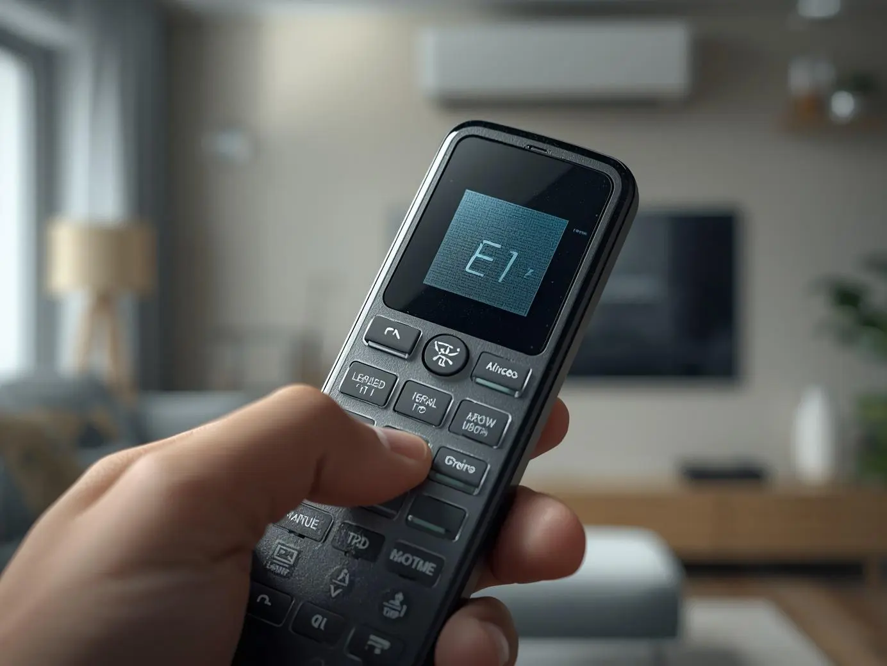

تعد معرفة رموز اعطال التكييف هي الخطوة الأولى والأساسية للحفاظ على عمر جهازك وتوفير تكاليف  <a href="https://fekrasolutions.github.io/fixurion-egypt-appliance-fix/services.html">خدمة تصليح التكييف</a>. ففي ظل الأجواء الحارة في مصر، يصبح التكييف شريان الحياة داخل المنازل وأماكن العمل، وظهور كود خطأ على الشاشة قد يسبب إزعاجاً كبيراً. يهدف هذا الدليل المقدم من منصة "فيكسوريون" إلى تحويل تلك الرموز المبهمة إلى معلومات واضحة تمكنك من تشخيص المشكلة بدقة، سواء كانت تتعلق بالحساسات، ضغط الفريون، أو الدوائر الكهربائية. سنستعرض معاً قائمة شاملة تغطي كافة الاحتمالات، مع تقديم حلول عملية تساعدك في اتخاذ القرار الصحيح، سواء بالإصلاح البسيط أو الاستعانة بفني محترف.

---

## رمز العطل E1

### وصف العطل والمشكلة
يشير رمز E1 عادةً إلى وجود خلل في دائرة الحماية من الضغط العالي للنظام، حيث يتوقف الضاغط (الكومبريسور) عن العمل لحماية الأجزاء الداخلية من التلف نتيجة ارتفاع الضغط بشكل غير طبيعي.

### الأسباب المحتملة
- اتساخ شديد في <a href="https://en.wikipedia.org/wiki/Capacitor_types" target="_blank">مكثف التكييف، </a> (الوحدة الخارجية) مما يعيق تبادل الحرارة  
- وجود زيادة مفرطة في شحنة غاز الفريون داخل الدائرة  
- توقف مروحة الوحدة الخارجية عن الدوران أو ضعف سرعتها  
- انسداد في الأنابيب الشعرية أو صمامات التمدد  

### طرق الإصلاح المقترحة
- تنظيف زعانف الوحدة الخارجية باستخدام ضغط ماء مناسب لإزالة الأتربة  
- فحص المروحة الخارجية والتأكد من سلامة الكابستور الخاص بها  
- استخدام أجهزة القياس للتأكد من مستويات الفريون وتفريغ الزيادة إن وجدت  
- فحص مفتاح الضغط العالي (High Pressure Switch)  

---

## رمز العطل E2

### وصف العطل والمشكلة
يشير هذا الرمز إلى تفعيل نظام الحماية ضد التجمد (Anti-freezing protection)، حيث يقوم جهاز التكييف بإيقاف عملية التبريد تلقائياً عندما تنخفض درجة حرارة المبخر بشكل كبير، وذلك لمنع تكوّن الثلج على الملفات الداخلية وحماية مكونات الجهاز من التلف وضمان استمرار كفاءته التشغيلية بشكل آمن.

### الأسباب المحتملة
- تراكم الأتربة على فلاتر الهواء  
- اتساخ المبخر الداخلي  
- نقص في شحنة الفريون  
- ضعف مروحة الوحدة الداخلية  

### طرق الإصلاح المقترحة
- تنظيف الفلاتر جيداً وتجفيفها  
- تنظيف المبخر بمواد مخصصة  
- فحص ضغط الغاز ومعالجة التسريب  
- التأكد من عدم وجود عوائق أمام الهواء  

---

## رمز العطل E3

### وصف العطل والمشكلة
يشير هذا الرمز إلى تفعيل نظام الحماية من الضغط المنخفض داخل جهاز التكييف، وهو ما يدل غالباً على وجود نقص في سائل التبريد (الفريون)، مما يؤثر على كفاءة التشغيل وقد يؤدي إلى تلف الضاغط إذا استمر الجهاز في العمل دون معالجة المشكلة بشكل سريع وآمن.

### الأسباب المحتملة
- تسريب غاز التبريد  
- انسداد جزئي في الدائرة  
- تلف حساس الضغط  
- تشغيل الجهاز في برد شديد  

### طرق الإصلاح المقترحة
- تحديد مكان التسريب وإصلاحه  
- إعادة شحن الفريون  
- تغيير حساس الضغط  

---

## رمز العطل E4

### وصف العطل والمشكلة
يشير هذا الرمز إلى ارتفاع خطير في درجة حرارة طرد الضاغط داخل جهاز التكييف، وهو ما قد يحدث نتيجة نقص الفريون أو ضعف التهوية أو وجود انسداد في الدائرة، ويؤدي ذلك إلى إجهاد مكونات الجهاز واحتمالية تلف الضاغط إذا لم يتم إيقافه ومعالجة السبب بسرعة.

### الأسباب المحتملة
- نقص الفريون  
- انسداد في الدائرة  
- ضعف مروحة الوحدة الخارجية  
- حرارة خارجية عالية  

### طرق الإصلاح المقترحة
- فحص ضغوط الغاز  
- تنظيف الوحدة الخارجية  
- قياس حمل الضاغط  
- فحص حساس الحرارة  

---

## رمز العطل E5

### وصف العطل والمشكلة
يشير هذا الرمز إلى تفعيل نظام الحماية من التيار الزائد داخل جهاز التكييف، حيث يقوم الجهاز بالفصل تلقائياً عند سحب تيار كهربائي أعلى من المعدل الطبيعي، وذلك لحماية المكونات الكهربائية والضاغط من التلف، وقد يكون السبب ضعف الكهرباء أو وجود خلل داخلي يتطلب الفحص السريع.

### الأسباب المحتملة
- ضعف الكهرباء  
- قفلة كهربائية  
- تلف الكابستور  
- اتساخ المكثف  

### طرق الإصلاح المقترحة
- قياس الجهد الكهربائي  
- استبدال الكابستور  
- تنظيف الوحدة الخارجية  
- فحص التوصيلات  

---

## رمز العطل F1 / F2

### وصف العطل والمشكلة
يشير هذا الرمز إلى وجود خلل في حساسات الحرارة داخل جهاز التكييف، مثل حساس الغرفة أو حساس المبخر، مما يؤدي إلى قراءات غير دقيقة لدرجة الحرارة، وقد يتسبب ذلك في ضعف الأداء أو توقف الجهاز، لذلك يُنصح بفحص التوصيلات أو استبدال الحساس التالف لضمان التشغيل الصحيح.

### الأسباب المحتملة
- قطع في الأسلاك  
- خروج الحساس من مكانه  
- تلف الحساس  
- رطوبة في الكارت  

### طرق الإصلاح المقترحة
- تثبيت التوصيلات  
- قياس المقاومة  
- استبدال الحساس  

---

## اتصل بـ فيكسوريون الآن - صيانة التكييف في كل محافظات مصر
نقدم لك صيانة فورية في المنزل، المحلات التجارية، الشركات، والمصانع. صيانة جميع أنواع المكيفات بجودة عالية، قطع غيار أصلية، سرعة، وأمان. [تواصل معنا](https://wa.me/201142220157) الآن.

📍 القاهرة - 📍 الجيزة - 📍 الدقهلية - 📍 الإسكندرية - 📍 الساحل الشمالي - 📍 العين السخنة - 📍 بورسعيد  
📍 السويس - 📍 المنصورة - 📍 أسيوط - 📍 الأقصر - 📍 أسوان - 📍 طنطا - 📍 دمياط - 📍 الفيوم - 📍 المنيا  
📍 قنا - 📍 سوهاج - 📍 بنها - 📍 كفر الشيخ - 📍 مرسى مطروح - 📍 الإسماعيلية

---

## رمز العطل H3

### وصف العطل والمشكلة
يشير هذا الرمز إلى تفعيل نظام الحماية من زيادة الحمل على الضاغط داخل جهاز التكييف، حيث يقوم الجهاز بإيقاف التشغيل تلقائياً عند تعرض الضاغط لإجهاد زائد أو ارتفاع في حرارته، وذلك لمنع تلفه، وقد يكون السبب ضعف التهوية أو التشغيل المستمر لفترات طويلة دون توقف.

### الأسباب المحتملة
- تعطل المروحة الخارجية  
- تشغيل مستمر لفترة طويلة  
- وجود هواء في الدائرة  
- ضعف العزل الحراري  

### طرق الإصلاح المقترحة
- إيقاف الجهاز للتبريد  
- فحص المروحة  
- عمل فاكيوم وإعادة شحن  

---

## رمز العطل EC

### وصف العطل والمشكلة
يشير هذا الرمز إلى اكتشاف تسريب في غاز التبريد (الفريون) داخل جهاز التكييف، مما يؤدي إلى انخفاض كفاءة التبريد واحتمال توقف الضاغط لحمايته، وقد يكون السبب وجود ثقب في المواسير أو عدم إحكام الوصلات، لذلك يجب فحص النظام وإصلاح التسريب ثم إعادة شحن الغاز بشكل صحيح.

### الأسباب المحتملة
- ثقب في المواسير  
- عدم إحكام الوصلات  
- انسداد الدائرة  
- خلل في الحساس  

### طرق الإصلاح المقترحة
- فحص بالصابون  
- استخدام جهاز كشف التسريب  
- إصلاح وإعادة شحن  
- عمل Reset  

---

## رمز العطل P1

### وصف العطل والمشكلة
يشير هذا الرمز إلى وجود خلل في جهد الكهرباء المغذي لجهاز التكييف، سواء كان انخفاضاً أو ارتفاعاً غير طبيعي، مما قد يؤثر على كفاءة التشغيل ويعرض المكونات للتلف، لذلك يقوم الجهاز بالفصل تلقائياً للحماية، ويُنصح بفحص مصدر الكهرباء واستخدام منظم جهد عند الحاجة.

### الأسباب المحتملة
- ضعف الجهد  
- ارتفاع الجهد  
- مشاكل في التوصيل  
- أحمال زائدة  

### طرق الإصلاح المقترحة
- قياس الجهد  
- استخدام منظم كهرباء  
- تحسين التوصيلات  

---

## رمز العطل P4

### وصف العطل والمشكلة
يشير هذا الرمز إلى وجود خطأ في تشغيل ضاغط الإنفرتر داخل جهاز التكييف، حيث يفشل الكارت الإلكتروني في التحكم بسرعة الضاغط أو استشعار موقعه بشكل صحيح، مما قد يؤدي إلى توقف التبريد أو تلف المكونات، ويتطلب فحص الأسلاك والملفات وربما إصلاح أو استبدال مديول التحكم.

### الأسباب المحتملة
- تلف مديول IPM  
- ضعف العزل  
- مشاكل في التوصيل  
- ارتفاع حرارة الكارت  

### طرق الإصلاح المقترحة
- فحص الأسلاك  
- قياس ملفات الضاغط  
- تنظيف الكارت  
- إصلاح أو تغيير المديول  

---

## رمز العطل F5

### وصف العطل والمشكلة
يشير هذا الرمز إلى فشل مروحة الوحدة الداخلية في جهاز التكييف، حيث تتوقف عن الدوران أو لا تعمل بالسرعة المطلوبة، مما يؤدي إلى ضعف التبريد أو تجمد المبخر، وقد يكون السبب تراكم الأوساخ، تلف الكابستور أو المحرك، ويتطلب تنظيف المروحة وفحص التوصيلات أو استبدال المحرك التالف.

### الأسباب المحتملة
- تراكم الأوساخ  
- تلف الكابستور  
- احتراق المحرك  
- وجود عائق  

### طرق الإصلاح المقترحة
- تنظيف وتزييت المروحة  
- فحص التوصيلات  
- استبدال المحرك  

---

## الخاتمة

في الختام، يظل فهم رموز اعطال التكييف هو الخط الدفاعي الأول لحماية استثمارك وضمان جو مريح داخل منزلك. إن ظهور هذه الأكواد ليس مجرد تنبيه بوجود خلل، بل هو وسيلة ذكية لمنع تفاقم المشكلات وتحولها إلى أعطال مكلفة.

ننصحك دائماً في <a href="https://fekrasolutions.github.io/fixurion-egypt-appliance-fix">فيكسوريون</a> ببدء الفحص بالخطوات البسيطة مثل تنظيف الفلاتر والتأكد من استقرار التيار الكهربائي قبل الاستعانة بفني. الصيانة الدورية هي الضمان الحقيقي لاستمرار كفاءة التبريد وإطالة عمر الجهاز.
